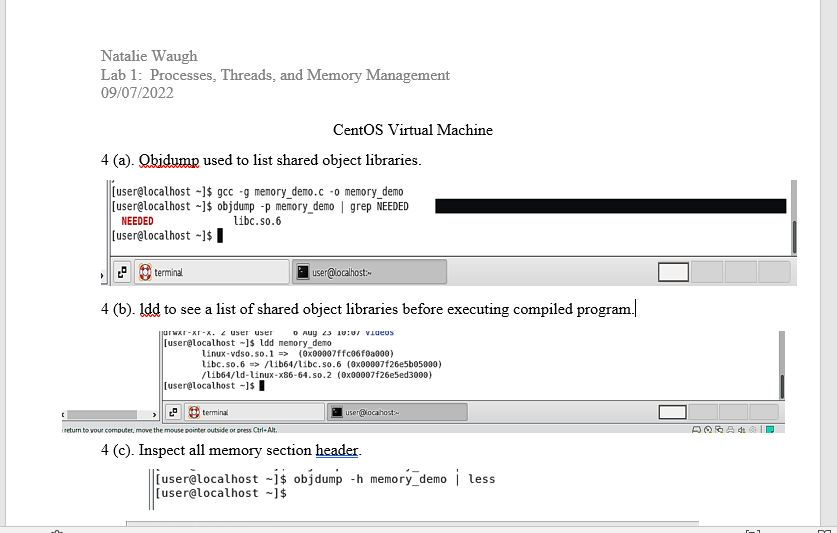
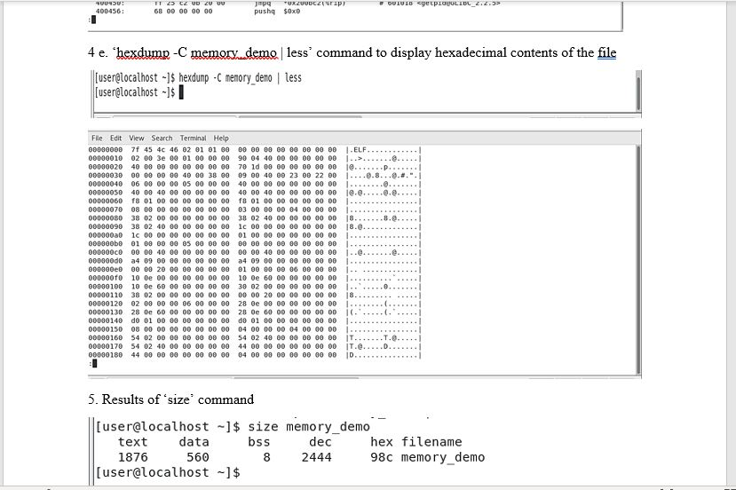
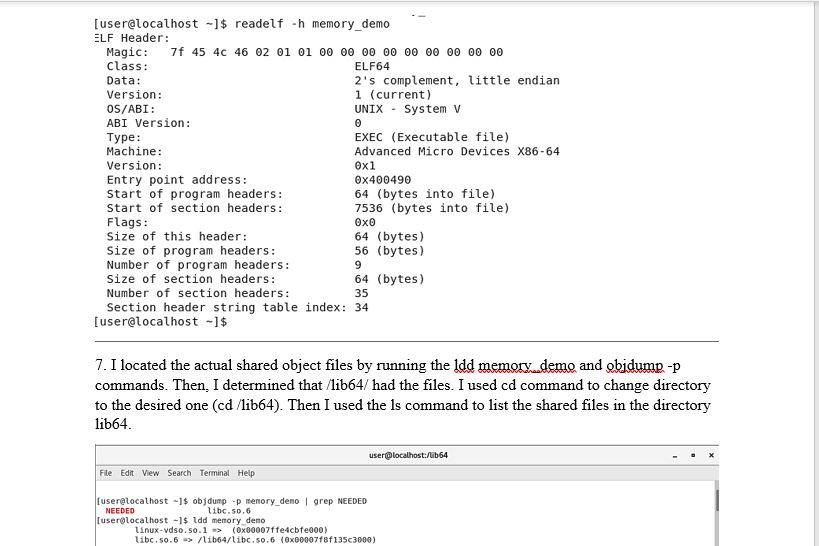
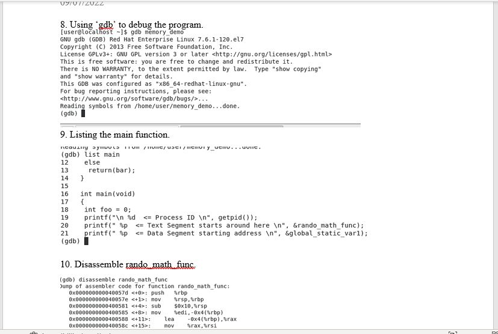
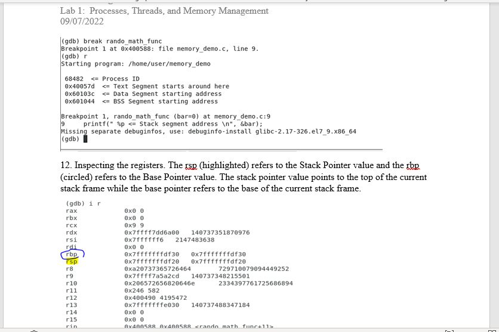
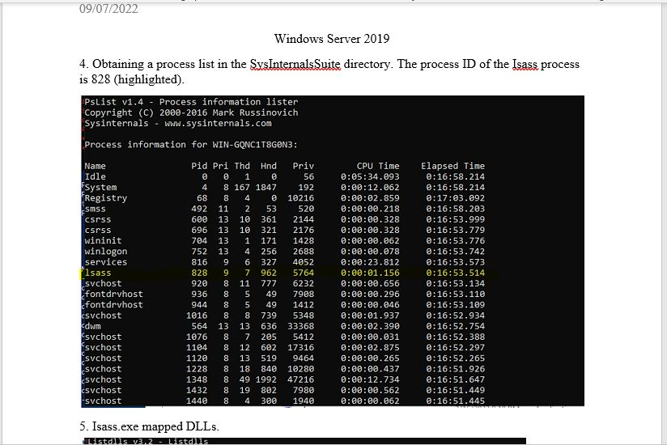
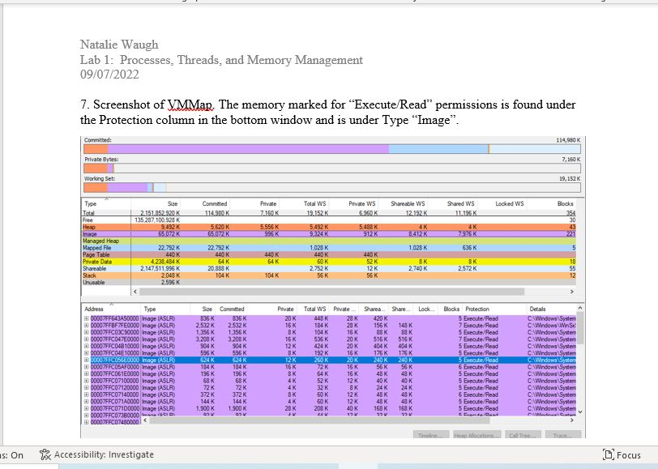

# Lab 1 - Processes, Threads, and Memory Management

For this lab, the Development Tools on the CentOS VM and the Sysinternals Suite on the Windows Server 2019 VM was installed in order to complete the steps. The lab's purpose was to become familiar with some of the basic tools and the way that Linux and Windows create and manage processes and memory.

