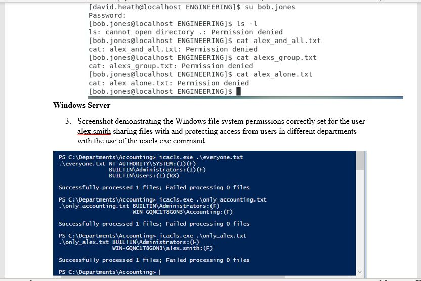

# Lab 2 - File System Access Controls

This lab assignment deals with configuring features in CentOS and Windows Server 2019 related to file system permissions and security controls. It also demonstrates these three features:  
	* Demonstrating the Linux file system permissions correctly set for user alex.smith sharing files with and protecting access from the user bob.jones for the anyone.txt file, my_group.txt file, and the only_me.txt file.
	* Demonstrating the Linux file system permissions correctly set for user alex.smith sharing files with and 	protecting access from the user david.heath for the anyone.txt file, my_group.txt file, and the only_me.txt file.
	* Demonstrating the Windows file system permissions correctly set for the user alex.smith sharing files with and 	protecting access from users in different departments with the use of the icacls.exe command.

