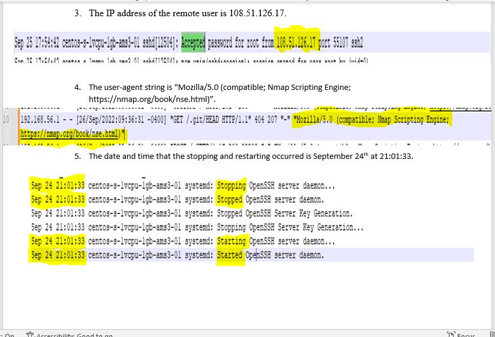

# Week 3 - Logging and Log Analysis

For this lab, actions were taken to view and filter Windows Event Logs, configure auditing for security - related Windows events, ability to change the Windows Event Log size, and view and analyze Linux event logs. 

For Windows Server 2019, I inspected the Windows Audit Policy, enabled successful and failed logon event logging using the GUI interface, set Windows Event Log size, viewed and filtered event logs in the Event Viewer, and viewed and filtered event logs from the PowerShell.

For Linux, I inspected the Linux log files, found events in the 'secure'file for SSH login attempts, found events in the 'access.log' file for Apache, found events in the 'messages' log, and demonstrated at what time the system stopped and then started the OpenSSH server daemon.

