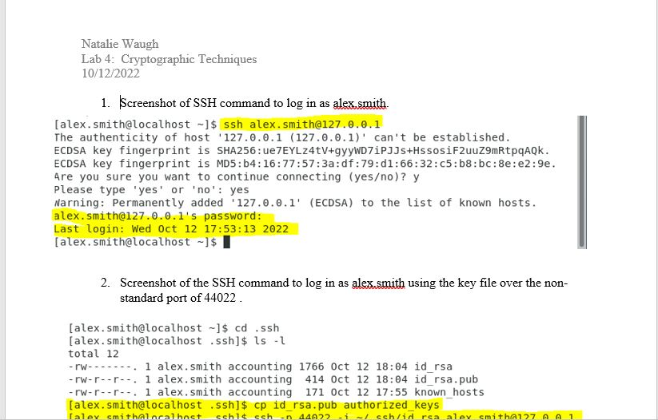
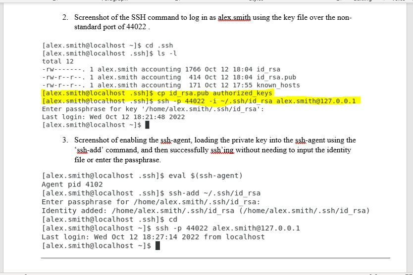

# Lab 4 - Cryptographic Techniques

With Lab 4, I explored the use of public key encryption in order to protect network traffic and remote access to systems. This lab only used the CentOS virtual machine. This required logging in as a user and then 'su' up to root or using the 'sudo' command to perform admininstration techniquies. This allows better logging and visibility into which accounts are performing what actions on any system. 

* The first screenshot showed successful use of the SSH command to log in as alex.smith.
* The second screenshot showed successful use of the SSH command to log in as alex.smith using the key file over the non-standard port of 44022.
* The third screenshot showed enabling of the ssh-agent, loading the private key into the ssh-agent using the 'ssh-add' command, and then successfully ssh'ing without needing to input the identity file or enter the passphrase.

