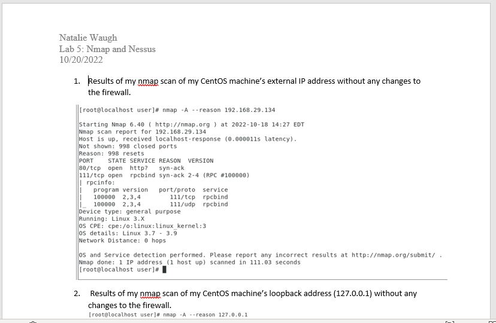
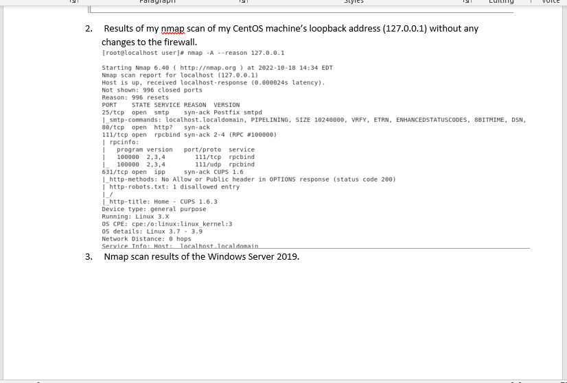
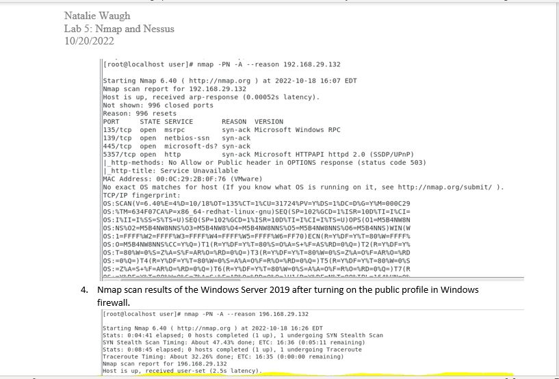
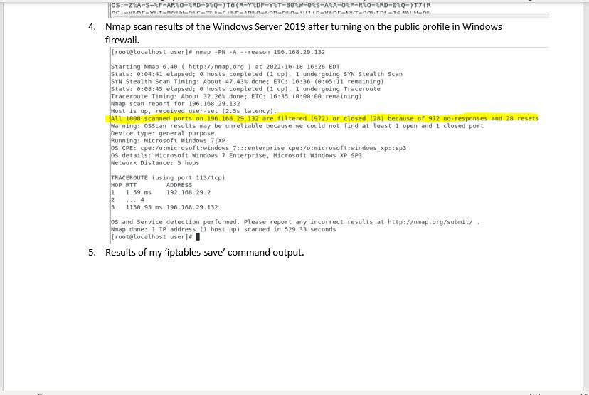
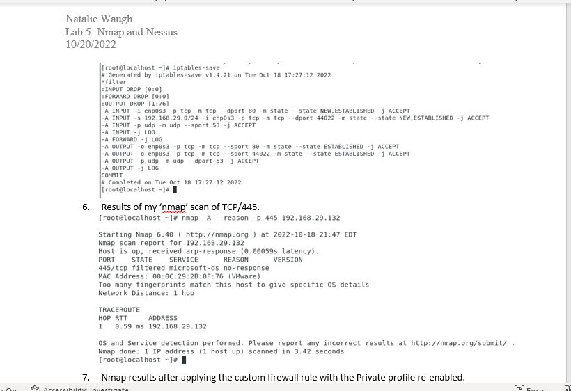
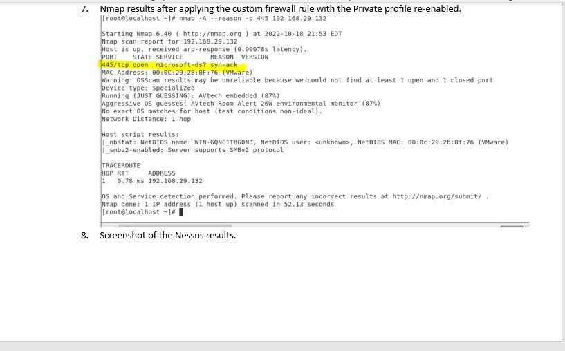
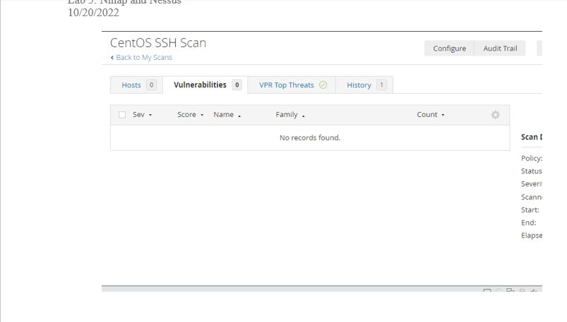

# Lab 5 - NMap and Nessus

This lab builds upon prior labs and will explore hardening of a system while also introducing some known vulnerabilities to test the limits of the hardening. The objectives for this lab are the following:

* Demonstrate an understanding of host-based firewalls in Linux using iptables.
* Demonstrate an understanding of host-based firewalls in Windows using the Windows Firewall with Advanced Security.
* Demonstrate an understanding of network scanning techniques using nmap.
* Harden a Linux and Windows host by configuring custom firewall rules to block all except necessary inbound and outbound network connections.
* perform a vulnerability scan on a host using the Nessus product from Tenable.

