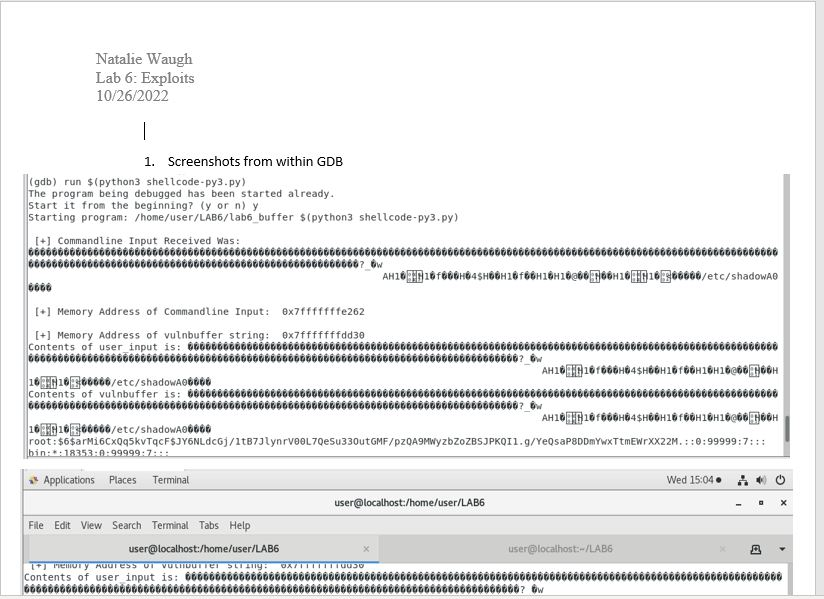
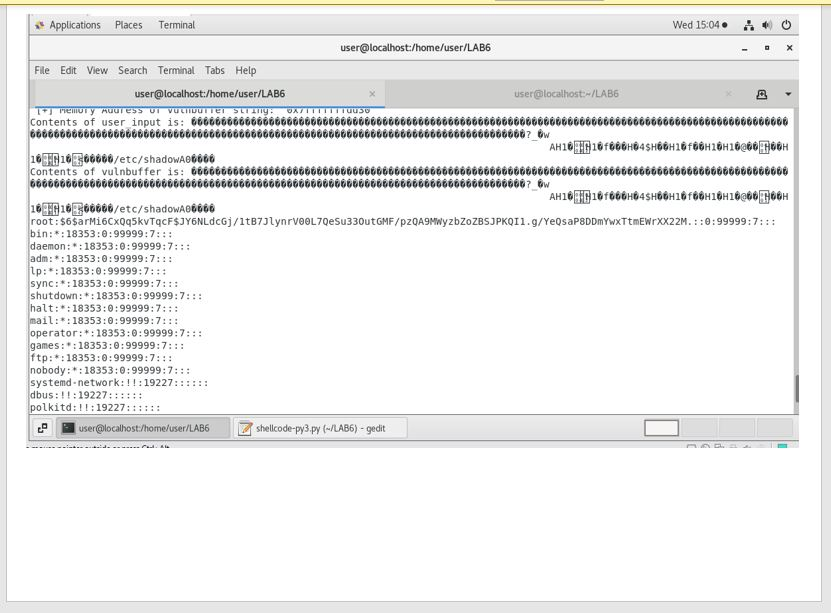
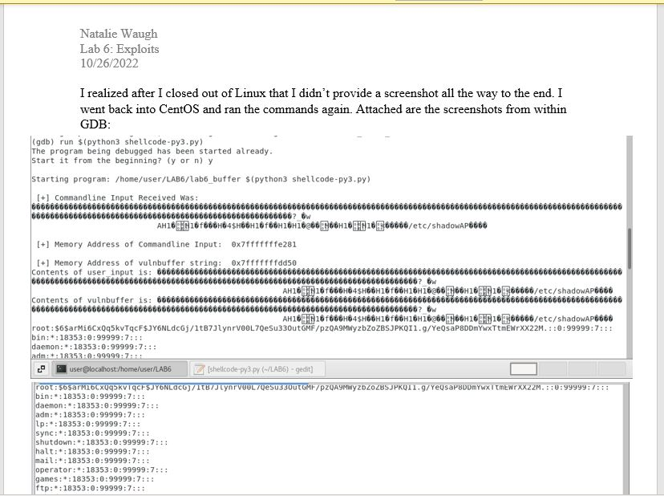
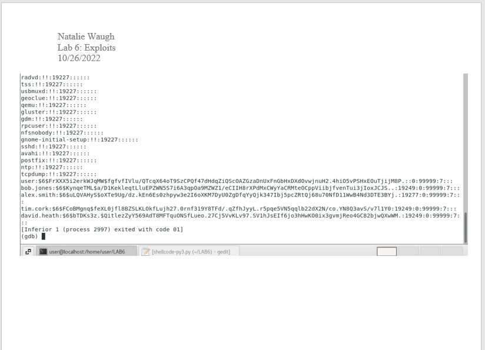

# Lab 6 - Exploits

For this lab, I explored how stack buffer overflows work, obtained control of the CPU instruction pointer, obtained and inserted shellcode to the buffer, and managed to execute the shellcode to complete the exploitation of the vulnerable application. The screenshots were of the exploit running against the vulnerable program and mention if I ran into any problems. For this to work, the 'Development Tools' packed had to be installed from Lab 1, which icnludes the GDB debugger and the Python3 packages.

