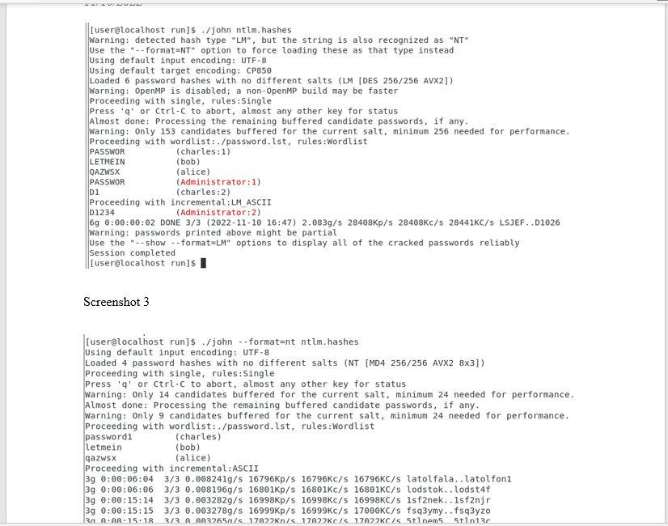

# Lab 7 - Credential Abuse, Password Cracking

In this lab, I downloaded the open source password cracking tool John The Ripper, compiled the source code, downloaded one Linux password hash file, and downloaded one Windows password hash file. I then used the John The Ripper to attempt to crack as many of the user account password hashes in those files as I could.

