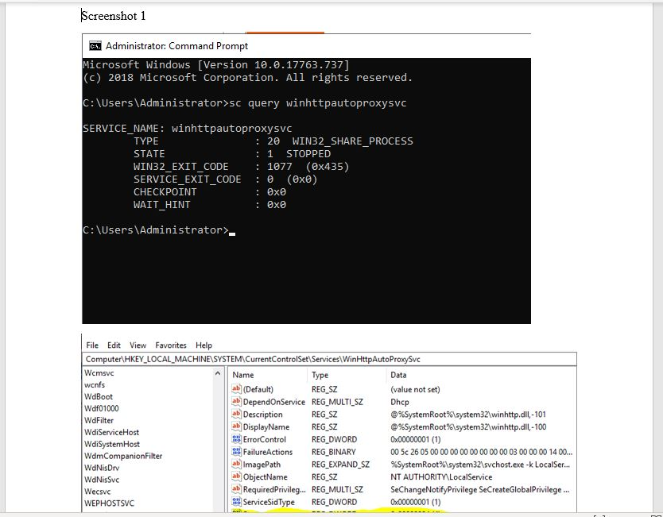
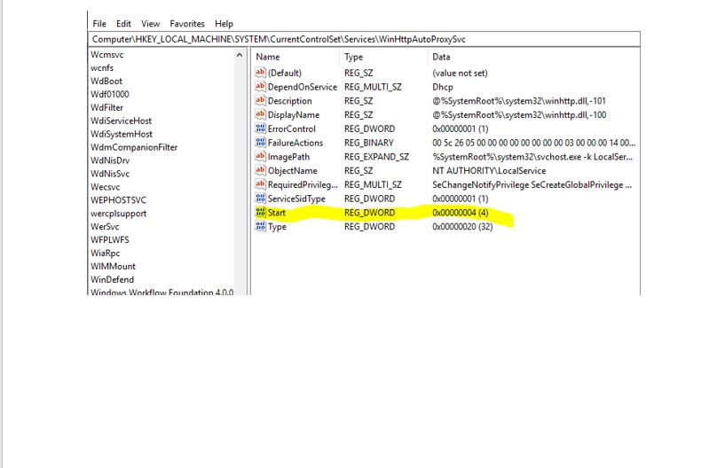
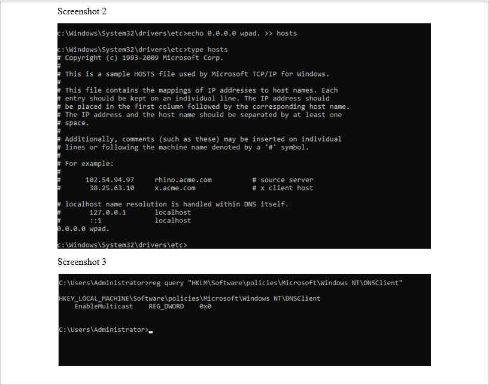
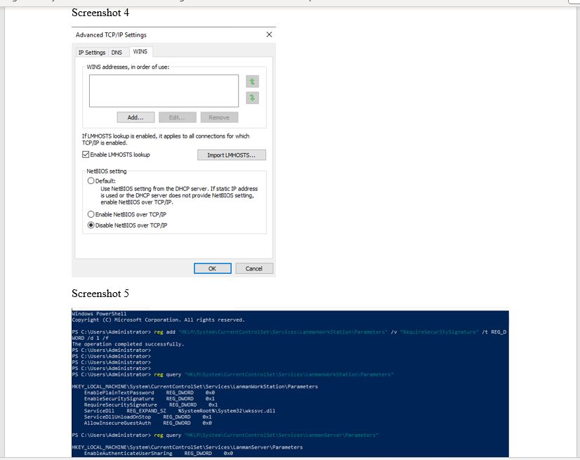
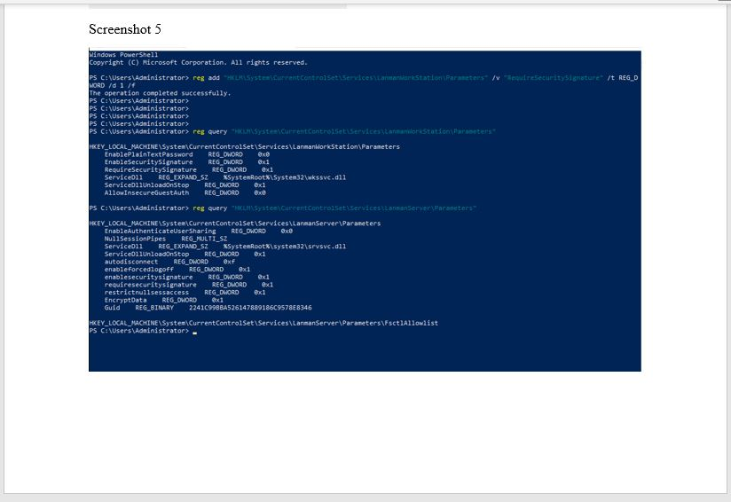
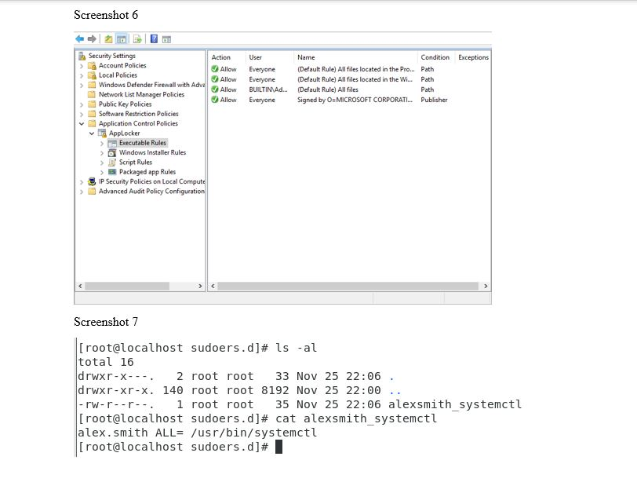
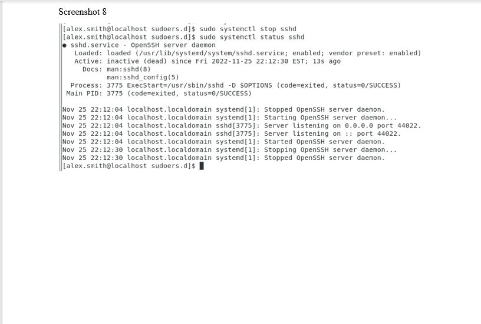

# Lab 8 - Windows and Linux Hardening

This final lab explored some hardening configuration settings of the Windows Server 2019 and CentOS Linux operating systems. Configuration chages were made to Windows using the Registry, Local Security Policy, Services, and Powershell to reduce the system's attack surface, exposure to local network attacks, reduce the exposure to pass the hash and other credential attacks, and help enforce least privilege. On the Linux system, enforcing least privilege was done by configuring the 'sudo' command for one of the user accounts.

The following screenshots are:
* 1: Screenshot of Registry key addition and value set along with screenshot of the ‘sc
query winhttpautoproxysvc’ command showing the service stopped.
* 2: Screenshot of the updated hosts file
* 3: Screenshot of the results of this above reg query command for LLMNR.
* 4: Screenshot of the Advanced TCP/IP Settings window showing NetBIOS disabled.
* 5: Screenshot of the above command executing showing SMB Signature
* 6: Screenshot of the AppLocker Executable Rules entry.
* 7: Screenshot of creation of the alexsmith_systemctl file as root in the /etc/sudoers.d
directory
* 8: Screenshot of output from the sudo systemctl stop sshd, immediately followed by the
sudo systemctl status sshd as the user alex.smith

